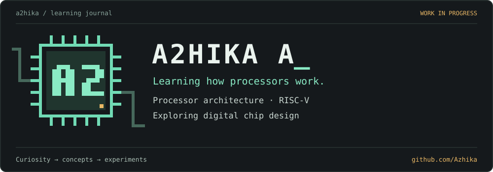
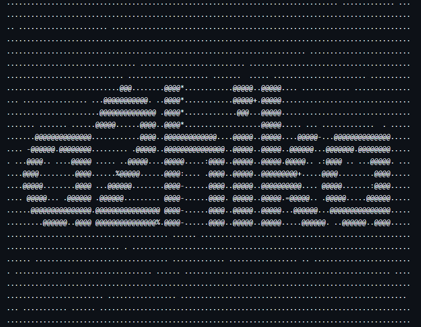

<a href="https://github.com/Azhika?tab=repositories">Explore repositories</a> &nbsp; / &nbsp;
<a href="https://github.com/Azhika/RISCV_32I_Pipelined_Core">RISC-V core</a> &nbsp; / &nbsp;
<a href="https://github.com/Azhika/therma-heat-strain-dashboard">Therma</a>

### Currently learning

I’m exploring **processor architecture and RISC-V**, and working toward understanding **digital chip design**. This profile brings together my projects, practice, and learning notes.

- [Processor design exploration](https://github.com/Azhika/RISCV_32I_Pipelined_Core)
- [Digital electronics learning notes](https://github.com/Azhika/digital_electronics)
- [Memory and buffer concepts](https://github.com/Azhika/digital_electronics/tree/main/memory)

### Selected work

The technologies below describe each project’s implementation, rather than a list of skills I’ve mastered.

| Project | Focus | Technologies used in the project |
| :--- | :--- | :--- |
| **[RISC-V pipelined core](https://github.com/Azhika/RISCV_32I_Pipelined_Core)** | Processor design exploration | TL-Verilog |
| **[Combinational circuits](https://github.com/Azhika/combinational-circuits-vivado-execution-)** | Logic circuits and testbenches executed in Vivado | Verilog · Vivado |
| **[HDLBits solutions](https://github.com/Azhika/HDLBits-Verilog-solutions)** | Digital logic practice | Verilog |
| **[Therma](https://github.com/Azhika/therma-heat-strain-dashboard)** | Heat-strain dashboard with anomaly inference and telemetry support | Next.js · TypeScript · FastAPI |

A2HIKA A / Learning through implementation, simulation, and iteration.
